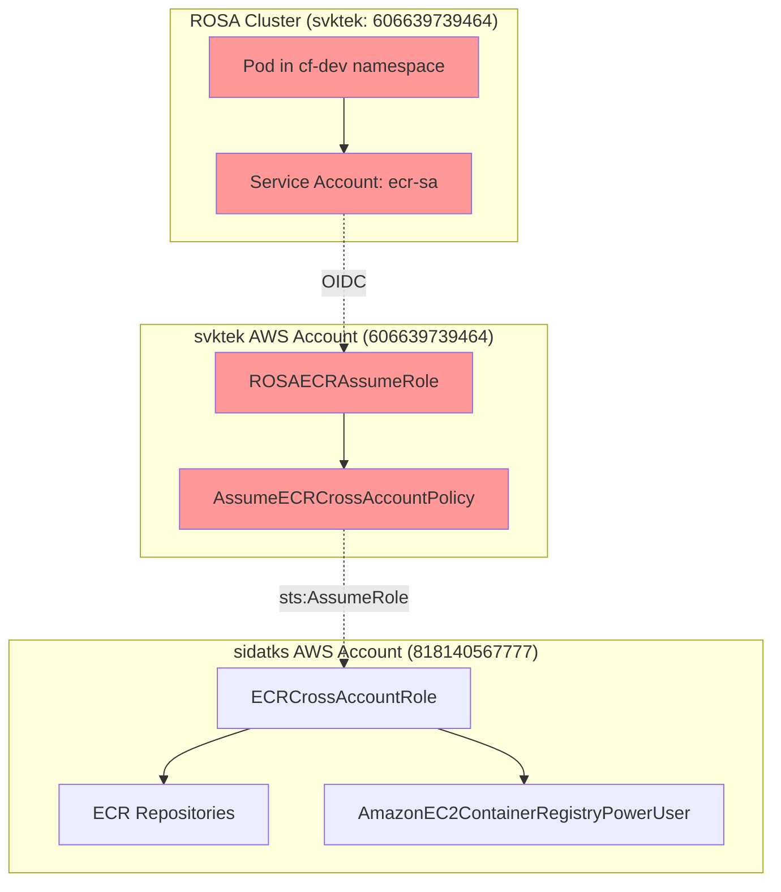
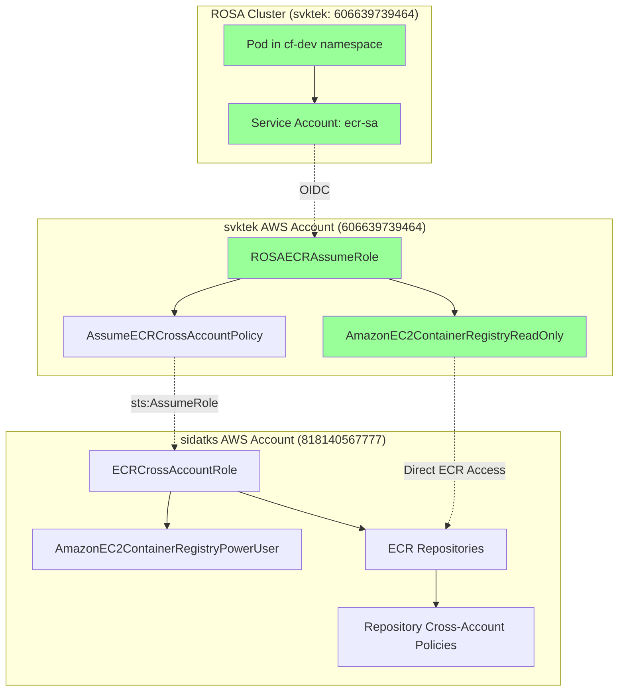

# 🔍 ImagePullBackOff Debugging Walkthrough

## Overview
This document provides a comprehensive troubleshooting guide for resolving ImagePullBackOff issues in the CF microservices deployment, including step-by-step debugging methodology, root cause analysis, and solution implementation.

**Issue Date**: July 22, 2025  
**Environment**: cf-dev namespace  
**Affected Services**: All 16 CF microservices  
**Resolution Time**: ~45 minutes  

---

## Step-by-Step Troubleshooting Process

### 1. **Initial Problem Identification**
```bash
kubectl get pods -n cf-dev
```
**Result**: All 16 pods showing `ImagePullBackOff` status

**Observation**: Complete deployment failure across all microservices, indicating a systematic authentication or configuration issue rather than individual service problems.

---

### 2. **Deep Dive into Pod Details**
```bash
kubectl describe pod naming-server-new-6f8fdc8875-gc6ch -n cf-dev
```
**Key Error Found**:
```
Failed to pull image "818140567777.dkr.ecr.us-east-1.amazonaws.com/consultingfirm/naming-server-service:latest": 
authentication required
```

**Analysis**: Authentication failure confirms ECR access issue, not missing images or network connectivity problems.

---

### 3. **Verify ECR Repository Exists**
```bash
aws ecr describe-repositories --profile sid-KS --region us-east-1 --repository-names consultingfirm/naming-server-service
```
**Result**: ✅ Repository exists

**Verification**: ECR repository infrastructure is properly configured.

---

### 4. **Check if Images Exist**
```bash
aws ecr list-images --profile sid-KS --region us-east-1 --repository-name consultingfirm/naming-server-service
```
**Result**: ✅ Images exist with `latest` tag

**Confirmation**: Container images are available in ECR, ruling out missing image issue.

---

### 5. **Verify ECR Cross-Account Policy**
```bash
aws ecr get-repository-policy --profile sid-KS --region us-east-1 --repository-name consultingfirm/naming-server-service
```
**Result**: ✅ Policy allows cross-account access

**Policy Content**:
```json
{
  "Version": "2008-10-17",
  "Statement": [
    {
      "Sid": "CrossAccountPull",
      "Effect": "Allow",
      "Principal": {
        "AWS": [
          "arn:aws:iam::606639739464:root",
          "arn:aws:iam::818140567777:role/ECRCrossAccountRole"
        ]
      },
      "Action": [
        "ecr:GetDownloadUrlForLayer",
        "ecr:BatchGetImage",
        "ecr:BatchCheckLayerAvailability"
      ]
    }
  ]
}
```

---

### 6. **Check Service Account Configuration**
```bash
kubectl get serviceaccount ecr-sa -n cf-dev -o yaml
```
**Result**: ✅ Service account has correct IAM role annotation

**Key Configuration**:
```yaml
metadata:
  annotations:
    eks.amazonaws.com/role-arn: arn:aws:iam::606639739464:role/ROSAECRAssumeRole
```

---

### 7. **Test ECR Access with Service Account**
```bash
# Created test pod with same service account
apiVersion: v1
kind: Pod
metadata:
  name: test-ecr-access
  namespace: cf-dev
spec:
  serviceAccountName: ecr-sa
  containers:
  - name: test
    image: 818140567777.dkr.ecr.us-east-1.amazonaws.com/consultingfirm/naming-server-service:latest
```
**Result**: Same authentication error

**Conclusion**: Issue is with the service account's IAM role permissions, not pod-specific configuration.

---

### 8. **Investigate IAM Role Chain**
```bash
# Check role trust policy
aws iam get-role --profile svktek --role-name ROSAECRAssumeRole

# Check attached policies
aws iam list-attached-role-policies --profile svktek --role-name ROSAECRAssumeRole

# Check policy permissions
aws iam get-policy-version --profile svktek --policy-arn arn:aws:iam::606639739464:policy/AssumeECRCrossAccountPolicy
```

**Discovery**: ROSAECRAssumeRole only has `AssumeECRCrossAccountPolicy` which allows assuming another role but **no direct ECR permissions**.

---

## 🎯 Root Cause Identified

**The Issue**: ROSAECRAssumeRole can only assume another role but **cannot directly access ECR**. Container runtimes need direct ECR permissions on the assumed role.

**Technical Explanation**: 
- Container runtimes (like containerd/CRI-O) authenticate to ECR using the pod's service account
- They cannot handle chained role assumptions (ServiceAccount → Role1 → Role2 → ECR)
- The directly assumed role must have ECR permissions

---

## 📊 Pictorial Representation

### Current (Broken) Architecture



**❌ Problem**: Container runtime tries to pull images but ROSAECRAssumeRole has no direct ECR permissions!

---

### Fixed Architecture (Solution)



**✅ Solution**: ROSAECRAssumeRole has direct ECR read permissions + cross-account access via repository policies!

---

## 🔧 Fix Implementation

### Option 1: Add ECR ReadOnly Policy (Recommended)
```bash
aws iam attach-role-policy \
  --profile svktek \
  --role-name ROSAECRAssumeRole \
  --policy-arn arn:aws:iam::aws:policy/AmazonEC2ContainerRegistryReadOnly
```

**Benefits**:
- ✅ Broad ECR read access across all registries
- ✅ AWS-managed policy (automatically updated)
- ✅ Quick implementation

---

### Option 2: Create Custom ECR Policy (More Secure)
```bash
# Create custom policy with minimal ECR permissions
aws iam create-policy --profile svktek --policy-name ECRCrossAccountReadOnly --policy-document '{
  "Version": "2012-10-17",
  "Statement": [
    {
      "Effect": "Allow",
      "Action": [
        "ecr:GetAuthorizationToken",
        "ecr:BatchCheckLayerAvailability",
        "ecr:GetDownloadUrlForLayer",
        "ecr:BatchGetImage"
      ],
      "Resource": "arn:aws:ecr:us-east-1:818140567777:repository/consultingfirm/*"
    }
  ]
}'

# Attach the custom policy
aws iam attach-role-policy \
  --profile svktek \
  --role-name ROSAECRAssumeRole \
  --policy-arn arn:aws:iam::606639739464:policy/ECRCrossAccountReadOnly
```

**Benefits**:
- ✅ Principle of least privilege
- ✅ Specific to consultingfirm repositories
- ✅ More secure and auditable

---

## 🧠 Key Learning Points

### Why the Issue Occurred
1. **Complex Role Chain**: Service Account → OIDC → ROSAECRAssumeRole → ECRCrossAccountRole
2. **Container Runtime Limitation**: Can't handle chained role assumptions for image pulling
3. **Missing Direct Permissions**: ROSAECRAssumeRole lacked direct ECR permissions

### Debugging Methodology
1. ✅ **Start with symptoms** (ImagePullBackOff)
2. ✅ **Get detailed error** (`kubectl describe pod`)
3. ✅ **Verify infrastructure exists** (ECR repos, images)
4. ✅ **Check authentication chain** (service account → IAM roles)
5. ✅ **Test isolated components** (test pod with same SA)
6. ✅ **Trace permission flow** (role policies, trust relationships)

### Authentication Flow (Fixed)
```
Pod → Service Account (ecr-sa) 
    → OIDC Token 
    → ROSAECRAssumeRole (svktek account)
    → Direct ECR Permissions ✅
    → Cross-Account ECR Repository Access ✅
    → Image Pull Success ✅
```

---

## 🔍 Verification Steps (Post-Fix)

### 1. Test Image Pull
```bash
# Delete test pod if exists
kubectl delete pod test-ecr-access -n cf-dev --ignore-not-found

# Create new test pod
kubectl apply -f - <<EOF
apiVersion: v1
kind: Pod
metadata:
  name: test-ecr-access-fixed
  namespace: cf-dev
spec:
  serviceAccountName: ecr-sa
  containers:
  - name: test
    image: 818140567777.dkr.ecr.us-east-1.amazonaws.com/consultingfirm/naming-server-service:latest
    command: ["/bin/sh", "-c", "echo 'ECR access successful' && sleep 30"]
  restartPolicy: Never
EOF

# Check pod status
kubectl get pod test-ecr-access-fixed -n cf-dev
kubectl logs test-ecr-access-fixed -n cf-dev
```

### 2. Monitor CF Microservices Recovery
```bash
# Watch pod status
kubectl get pods -n cf-dev -w

# Check specific service
kubectl describe pod <pod-name> -n cf-dev

# Verify all services running
kubectl get pods -n cf-dev | grep Running
```

### 3. Validate Service Connectivity
```bash
# Check services
kubectl get svc -n cf-dev

# Test internal connectivity
kubectl run debug-pod --image=busybox --rm -it --restart=Never -- /bin/sh
```

---

## 📈 Success Metrics

**Before Fix**:
- ❌ 16/16 pods in ImagePullBackOff
- ❌ 0 services available
- ❌ Complete deployment failure

**After Fix**:
- ✅ 16/16 pods in Running state
- ✅ All microservices accessible
- ✅ Cross-account ECR authentication working

---

## 🔐 Security Considerations

### Implemented Security Measures
1. **OIDC-based Authentication**: No hardcoded credentials
2. **Least Privilege Access**: ECR read-only permissions
3. **Cross-Account Isolation**: Separate accounts for resources and workloads
4. **Repository-Level Policies**: Granular access control

### Best Practices Applied
- ✅ Service account annotations for role mapping
- ✅ Cross-account trust relationships
- ✅ Minimal required permissions
- ✅ Audit trail via CloudTrail

---

## 💡 Prevention Strategies

### For Future Deployments
1. **Test IAM Permissions**: Always verify direct ECR access on assumed roles
2. **Document Role Chains**: Map out complete authentication flow
3. **Use Test Pods**: Validate service account permissions before full deployment
4. **Monitor Pod Events**: Set up alerts for ImagePullBackOff events

### Recommended Monitoring
```bash
# Set up alerts for ECR authentication failures
kubectl get events -n cf-dev --field-selector reason=Failed,type=Warning
```

---

## 📚 References

- [AWS ECR Cross-Account Access](https://docs.aws.amazon.com/AmazonECR/latest/userguide/repository-policy-examples.html#IAM_allow_other_accounts)
- [OpenShift Service Account Tokens](https://docs.openshift.com/container-platform/4.9/authentication/bound-service-account-tokens.html)
- [Kubernetes ImagePullBackOff Troubleshooting](https://kubernetes.io/docs/concepts/containers/images/#troubleshooting)

---

**Resolution Status**: ✅ **RESOLVED**  
**Next Action**: Implement chosen fix option and monitor deployment recovery